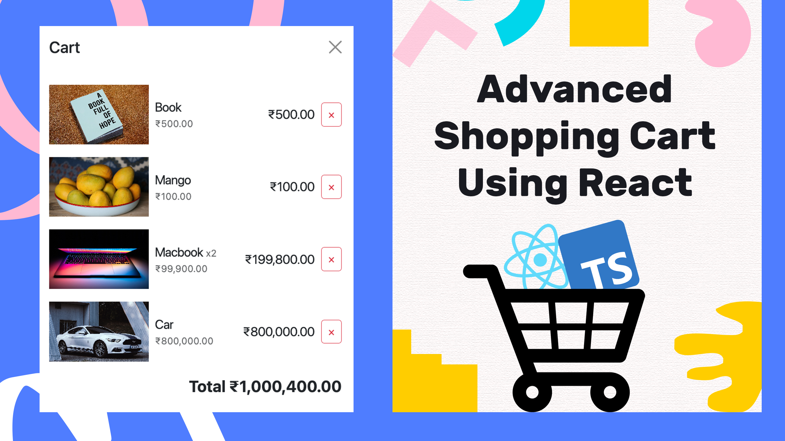

# Advanced Shopping Cart with React and TypeScript | How to Create an Shopping Cart Using React

An advanced shopping cart implemented with React and TypeScript is a powerful and sophisticated e-commerce solution. Leveraging React's dynamic UI capabilities and TypeScript's static typing, this shopping cart delivers a seamless and interactive online shopping experience. Users can easily browse, add, and manage products in the cart, while the checkout process is streamlined for efficiency. The combination of React and TypeScript ensures a modern, responsive, and error-resistant application, providing a feature-rich platform for both customers and online retailers.

